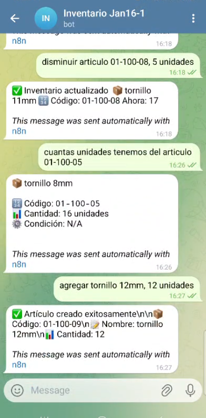

# 🤖 Sistema de Inventario Inteligente con IA

> Sistema completo de gestión de inventario mediante conversaciones naturales en Telegram, potenciado por Inteligencia Artificial.

[](README.md)
[](README.es.md)

[](https://opensource.org/licenses/MIT)
[](https://n8n.io)
[](https://openai.com)
[](https://baserow.io)

---

## 📋 Tabla de Contenidos

- [Acerca del Proyecto](#-acerca-del-proyecto)
- [Características](#-características)
- [Demo](#-demo)
- [Tecnologías](#-tecnologías)
- [Instalación](#-instalación)
- [Uso](#-uso)
- [Documentación](#-documentación)
- [Costos](#-costos)
- [Roadmap](#-roadmap)
- [Contribuir](#-contribuir)
- [Licencia](#-licencia)
- [Contacto](#-contacto)

---

## 🎯 Acerca del Proyecto

Este proyecto nació de la necesidad de crear un sistema de inventario **simple, económico y efectivo** para pequeñas empresas y organizaciones sin fines de lucro que no pueden costear sistemas tradicionales de $50-200/mes.

### El Problema

- ✘ Sistemas profesionales son caros y complejos
- ✘ Hojas de cálculo requieren disciplina y nadie las actualiza
- ✘ Apps móviles requieren capacitación y tienen curva de aprendizaje
- ✘ Papel y lápiz no es escalable ni confiable

### La Solución

Un bot de Telegram con Inteligencia Artificial que permite:
- ✅ Registrar artículos mediante conversación natural
- ✅ Consultar inventario con mensajes simples
- ✅ Actualizar cantidades sin formularios
- ✅ Base de datos real (PostgreSQL) con interfaz visual
- ✅ Costo operativo: $6-22/mes

**Ejemplo de uso:**

```
👤 "Agregar 5 sillas de oficina, en buen estado, bodega A"
🤖 "✅ Registrado: 5 sillas de oficina
    🏷️ Condición: buen estado
    📍 Ubicación: bodega A"
```

---

## ✨ Características

### Funcionalidades Principales

- 🗣️ **Conversaciones naturales en español** - Sin comandos complejos
- 📦 **Gestión completa de inventario** - Crear, consultar, modificar artículos
- 🧠 **IA conversacional** - Entiende contexto y extrae información automáticamente
- 📊 **Base de datos profesional** - PostgreSQL mediante Baserow
- 🔒 **Control de acceso** - Solo usuarios autorizados
- 💾 **Memoria de conversación** - El bot recuerda el contexto
- 📱 **Multi-plataforma** - Funciona desde cualquier dispositivo con Telegram

### Campos Gestionados

**Obligatorios:**
- Nombre del artículo
- Cantidad

**Opcionales (extraídos automáticamente si se mencionan):**
- Categoría
- Condición (nuevo, usado, bueno, etc.)
- Donador
- Ubicación
- Notas adicionales

---

## 🎥 Demo

### Conversación Completa

**Consultar producto:**
```
👤 Cuántas unidades de tornillo 10mm

🤖 📦 tornillo 10mm
   🔢 Código: 01-100-07
   📊 Cantidad: 10 unidades
   ⚙️ Condición: N/A
```

**Crear artículo nuevo:**
```
👤 Artículo nuevo, tornillo 15mm, 10 u

🤖 ✅ Artículo creado exitosamente
   📦 Código: 01-100-12
   📝 Nombre: tornillo 15mm
   📊 Cantidad: 10
```

**Restar unidades:**
```
👤 Restar 2 un a 01-100-12

🤖 ✅ Inventario actualizado
   📦 tornillo 15mm
   🔢 Código: 01-100-12
   Ahora: 8
```

**Agregar unidades:**
```
👤 Sumar 10 un a 01-100-12

🤖 ✅ Inventario actualizado
   📦 tornillo 15mm
   🔢 Código: 01-100-12
   Ahora: 18
```

**Verificar cantidad actualizada:**
```
👤 Unidades de tornillo 15mm

🤖 📦 tornillo 15mm
   🔢 Código: 01-100-12
   📊 Cantidad: 18 unidades
   ⚙️ Condición: N/A
```

**Crear producto (con texto en alemán):**
```
👤 Agregar nuevos productos: lagerschaler 10 Stück

🤖 ✅ Artículo creado exitosamente
   📦 Código: 01-100-13
   📝 Nombre: lagerschaler
   📊 Cantidad: 10
```

**Actualizar por código:**
```
👤 Agregar 10 un articulo 01-100-13

🤖 ✅ Inventario actualizado
   📦 lagerschaler
   🔢 Código: 01-100-13
   Ahora: 20
```

**Ayuda contextual:**
```
👤 Hola

🤖 ❌ No puedo continuar porque falta información.
   
   Por favor escribe el mensaje siguiendo UNA de estas opciones:
   
   1️⃣ Consultar un producto
   Ejemplo: "Consultar tornillo 4mm"
   Ejemplo: "Info del código 01-100-01"
   
   2️⃣ Agregar unidades a un producto existente
   Ejemplo: "Agregar 5 unidades al tornillo 4mm"
   Ejemplo: "Sumar 3 al código 01-100-01"
   
   3️⃣ Crear un producto nuevo
   Ejemplo: "Crear producto nuevo: guante quirúrgico, 10 unidades"
   Ejemplo: "Registrar artículo nuevo: taladro Bosch, 5 unidades"
   
   ⚠️ Importante:
   Solo se crean productos nuevos si lo indicas explícitamente.
```

### Características Demostradas

✅ **Búsqueda inteligente** - Por nombre o código  
✅ **Generación automática de códigos** - Sistema numérico  
✅ **Operaciones matemáticas** - Sumar/restar inventario  
✅ **Multi-idioma** - Español, alemán, etc.  
✅ **Ayuda contextual** - Guía cuando hay error  
✅ **Actualización en tiempo real** - Cambios inmediatos  

### Screenshots




---

## 🛠️ Tecnologías

| Componente | Tecnología | Propósito |
|------------|------------|-----------|
| **Automatización** | [n8n](https://n8n.io) | Orquestación de workflows |
| **IA** | [OpenAI GPT-4o-mini](https://openai.com) | Procesamiento de lenguaje natural |
| **Base de Datos** | [Baserow](https://baserow.io) | PostgreSQL con interfaz visual |
| **Interfaz** | [Telegram Bot API](https://core.telegram.org/bots) | Chat interface |
| **Deployment** | Docker | Containerización |

### Arquitectura

```
┌─────────────┐
│   Usuario   │
│  (Telegram) │
└──────┬──────┘
       │
       ▼
┌─────────────┐
│ Telegram    │
│ Bot API     │
└──────┬──────┘
       │
       ▼
┌─────────────┐      ┌─────────────┐
│     n8n     │─────▶│   OpenAI    │
│ (Workflows) │      │  GPT-4o-mini│
└──────┬──────┘      └─────────────┘
       │
       ▼
┌─────────────┐
│   Baserow   │
│ (PostgreSQL)│
└─────────────┘
```

---

## 🚀 Instalación

### Prerrequisitos

- Cuenta de [Telegram](https://telegram.org)
- Cuenta de [Baserow](https://baserow.io) (gratuita)
- Cuenta de [OpenAI](https://platform.openai.com) (requiere pago)
- Una de las siguientes opciones para n8n:
  - **Opción 1:** Cuenta de [n8n Cloud](https://n8n.cloud) (~$20/mes)
  - **Opción 2:** VPS con Docker (desde $5/mes)

### Opciones de Instalación

Ofrecemos **3 niveles de instalación** según tu experiencia técnica:

#### 📱 Nivel 1: Solo Base de Datos
**Para:** No técnicos que solo quieren la base de datos  
**Tiempo:** 10 minutos  
**Costo:** Gratis  
📖 [Ver tutorial](docs/es/02-configuracion-baserow.md)

#### 🚀 Nivel 2: Sistema Completo (n8n Cloud)
**Para:** Personas con conocimientos básicos  
**Tiempo:** 30-40 minutos  
**Costo:** ~$22/mes  
📖 [Ver tutorial](docs/es/03-instalacion-n8n-cloud.md)

#### 🛠️ Nivel 3: Sistema Completo (VPS Propio)
**Para:** Personas técnicas / Desarrolladores  
**Tiempo:** 1-2 horas  
**Costo:** ~$6-7/mes  
📖 [Ver tutorial](docs/es/04-instalacion-vps.md)

### Guía Rápida (Nivel 2 - n8n Cloud)

1. **Configurar Baserow**
   ```bash
   # Ver docs/es/02-configuracion-baserow.md
   # Crear cuenta, tabla y obtener API token
   ```

2. **Crear Bot de Telegram**
   ```bash
   # Buscar @BotFather en Telegram
   # /newbot
   # Guardar token
   ```

3. **Configurar OpenAI**
   ```bash
   # Crear cuenta en platform.openai.com
   # Agregar método de pago
   # Generar API key
   ```

4. **Crear instancia n8n Cloud**
   ```bash
   # Registrarse en n8n.cloud
   # Crear instancia (14 días gratis)
   ```

5. **Importar workflow**
   ```bash
   # Descargar workflows/inventario-baserow.json
   # Importar en n8n
   # Configurar credenciales
   ```

6. **¡Listo!** Envía un mensaje a tu bot de Telegram

---

## 💻 Uso

### Comandos Básicos

El bot NO usa comandos tradicionales. Solo conversación natural:

**Saludar / Ver menú:**
```
"Hola"
"Hello"
"Buenos días"
```

**Crear artículo (mínimo):**
```
"Crear 5 sillas"
"10 martillos"
"Agregar 3 laptops"
```

**Crear artículo (completo):**
```
"Crear 5 sillas de oficina, en buen estado, donadas por Juan, bodega A"
```

**Consultar:**
```
"Consultar sillas"
"¿Cuántas mesas tengo?"
"Buscar laptops"
```

**Modificar cantidad:**
```
"Aumentar 10 sillas"
"Agregar 5 mesas"
"Quitar 3 laptops"
"Disminuir 2 martillos"
```

### Flujo de Trabajo Típico

1. Usuario saluda al bot
2. Bot muestra menú de opciones
3. Usuario selecciona opción (o escribe directamente)
4. Bot procesa con IA y extrae información
5. Si falta info obligatoria, bot pregunta
6. Bot confirma y ejecuta acción
7. Datos se guardan automáticamente en Baserow

---

## 📚 Documentación

### Documentos Disponibles

| Documento | Descripción | Audiencia |
|-----------|-------------|-----------|
| [Instrucciones Generales](docs/es/01-instrucciones-generales.md) | Visión general y decisión de ruta | Todos |
| [Configuración Baserow](docs/es/02-configuracion-baserow.md) | Setup de base de datos | Principiantes |
| [Instalación n8n Cloud](docs/es/03-instalacion-n8n-cloud.md) | Sistema completo (fácil) | No técnicos |
| [Instalación VPS](docs/es/04-instalacion-vps.md) | Sistema completo (avanzado) | Técnicos |

### Archivos Adicionales

- `workflows/inventario-baserow.json` - Workflow de n8n listo para importar
- `prompts/agente-inventario.txt` - Prompts optimizados de OpenAI
- `ejemplos/datos-ejemplo.csv` - Datos de prueba para Baserow

---

## 💰 Costos

### Comparativa de Opciones

| Componente | Opción 1<br>(Solo DB) | Opción 2<br>(n8n Cloud) | Opción 3<br>(VPS) |
|------------|---------------------|---------------------|-----------------|
| Baserow | Gratis | Gratis | Gratis |
| OpenAI API | - | ~$1-2/mes | ~$1-2/mes |
| n8n | - | $20/mes | - |
| Hosting | - | - | $5/mes |
| **Total** | **$0** | **~$22/mes** | **~$6-7/mes** |

### Notas sobre Costos

- **Baserow:** Gratis hasta 5,000 filas (suficiente para mayoría de casos)
- **OpenAI:** Uso típico $1-2/mes con GPT-4o-mini. Puedes configurar límites.
- **n8n Cloud:** $20/mes (plan Starter). 14 días gratis de prueba.
- **VPS:** Desde $5/mes (Hostinger, DigitalOcean, etc.)

---

## 🗺️ Roadmap

### Versión Actual: v1.0

- [x] Conversaciones naturales en español
- [x] CRUD completo de inventario
- [x] Integración con Baserow
- [x] Memoria de conversación
- [x] Control de acceso por usuario
- [x] Documentación completa

### Versión 1.1 (En progreso)

- [ ] Búsqueda avanzada con filtros
- [ ] Exportar reportes por Telegram
- [ ] Alertas de stock bajo
- [ ] Soporte para códigos QR
- [ ] Comandos de voz

### Versión 2.0 (Futuro)

- [ ] Soporte multi-idioma
- [ ] Fotos de artículos
- [ ] Integración con WhatsApp
- [ ] Dashboard web
- [ ] API REST pública
- [ ] App móvil nativa

### Contribuciones Bienvenidas

¿Tienes ideas para mejorar? Abre un [Issue](../../issues) o envía un [Pull Request](../../pulls)

---

## 🤝 Contribuir

¡Las contribuciones son lo que hace que la comunidad open source sea increíble! Cualquier contribución que hagas será **muy apreciada**.

### Cómo Contribuir

1. Fork el proyecto
2. Crea tu Feature Branch (`git checkout -b feature/AmazingFeature`)
3. Commit tus cambios (`git commit -m 'Add some AmazingFeature'`)
4. Push al Branch (`git push origin feature/AmazingFeature`)
5. Abre un Pull Request

### Áreas donde Necesitamos Ayuda

- 📖 Mejorar documentación
- 🌍 Traducciones a otros idiomas
- 🐛 Reportar y corregir bugs
- ✨ Nuevas funcionalidades
- 🎨 Mejoras de UX en conversaciones
- 📹 Videos tutoriales

### Guía de Estilo

- Commits en español
- Código comentado en español
- Seguir estructura existente de archivos
- Probar antes de hacer PR

---

## 📄 Licencia

Distribuido bajo la Licencia MIT. Ver `LICENSE` para más información.

Esto significa que puedes:
- ✅ Usar comercialmente
- ✅ Modificar
- ✅ Distribuir
- ✅ Uso privado

Con la única condición de:
- ⚠️ Incluir la licencia y copyright notice

---

## 📞 Contacto

**Nombre** - [@instagram](https://www.instagram.com/fguevara.ia/)

**Proyecto:** [https://github.com/f-guevara/inventory-ai-telegram](https://github.com/f-guevara/inventory-ai-telegram)

**LinkedIn:** [https://www.linkedin.com/in/fernandoguevara-erpsystems/](https://www.linkedin.com/in/fernandoguevara-erpsystems/)

---

## 🙏 Agradecimientos

- [n8n](https://n8n.io) - Por la increíble plataforma de automatización
- [Baserow](https://baserow.io) - Por la base de datos open source
- [OpenAI](https://openai.com) - Por hacer accesible la IA
- [Telegram](https://telegram.org) - Por la API gratuita de bots
- La comunidad open source - Por inspirar este proyecto

---

## ⭐ Star History

Si este proyecto te fue útil, considera darle una estrella ⭐

[](https://star-history.com/#f-guevara/inventory-ai-telegram&Date)

---

## 📊 Estadísticas


---

**Hecho con ❤️ para la comunidad open source**